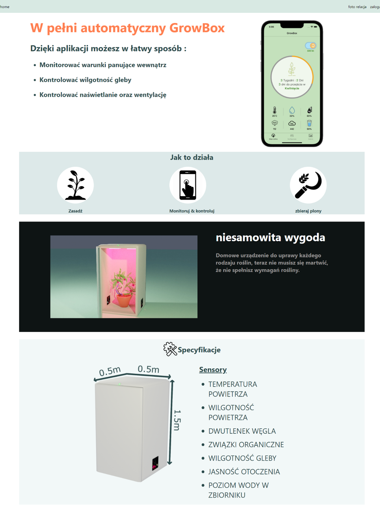
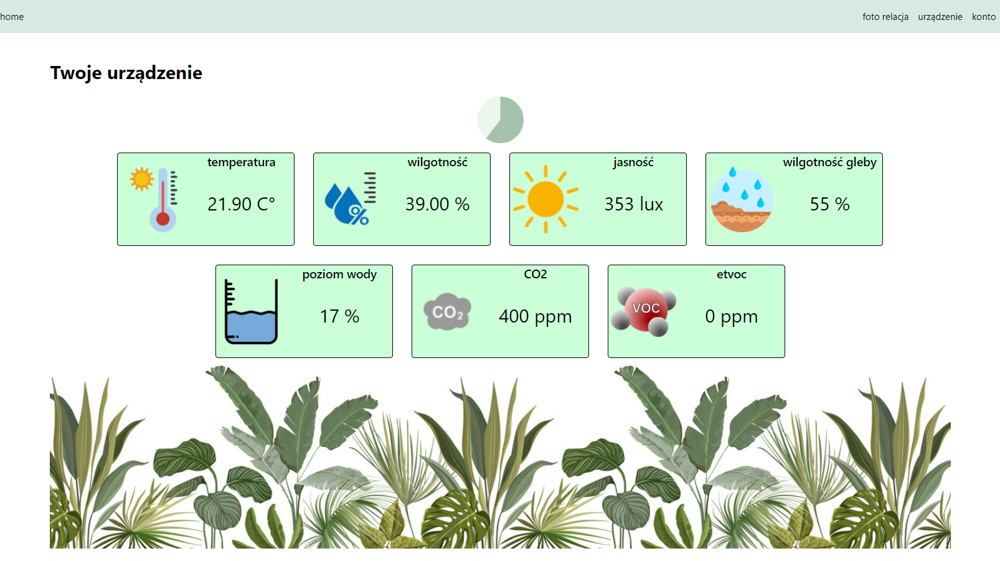
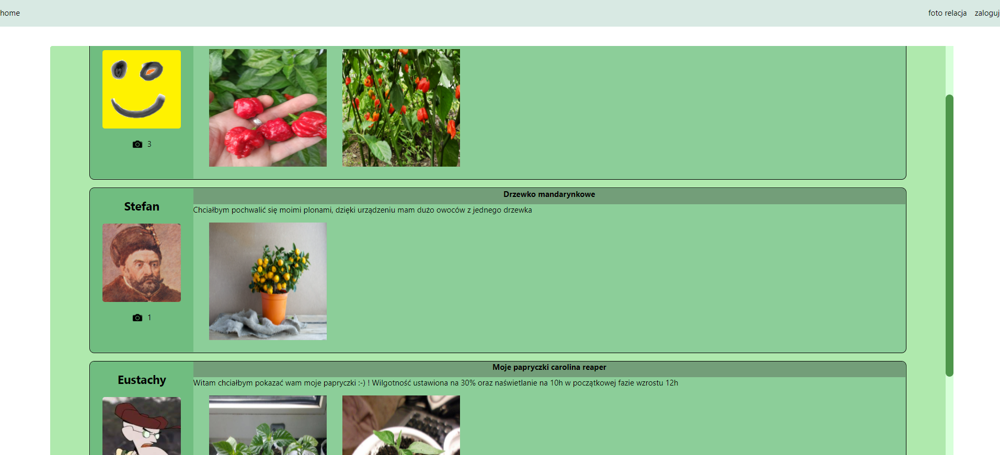

# GrowBox


## Applications features:
- Przedstawienie produktu 
- Monitorowanie warunków panujących w urządzeniu GrowBox
- Dodawanie fotorelacji 
- Rejestracja/logowanie

## Authentication:
- Możliwość rejestracji i logowania 
- Możliwość rejestracji urządzenia


## Screens: 
Strona główna


Co 30 sekund automatycznie odświeżane są wartości z czujników urządzenia.



Strona do dodawania fotorelacji



## Getting Started

First, run the development server:

```bash
npm run dev
# or
yarn dev
```
